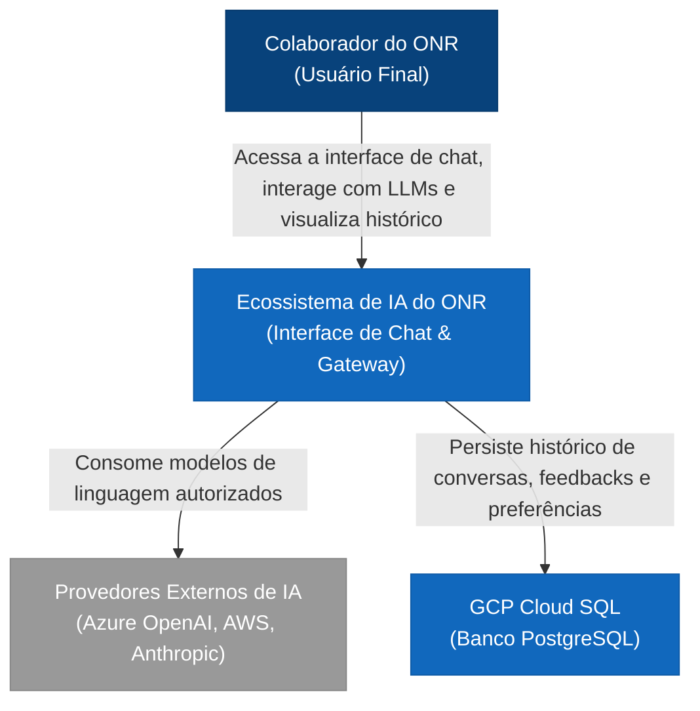
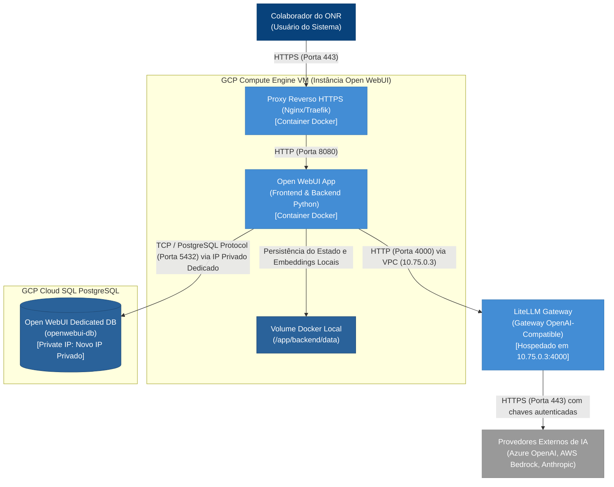

# Especificação de Arquitetura Técnica e Design Lógico - Integração Open WebUI no ONR

Este documento detalha o desenho arquitetural, topologia de rede, modelo de persistência, padrões de integração e diretrizes de infraestrutura para a implantação do **Open WebUI** integrado ao gateway corporativo **LiteLLM** na infraestrutura do **ONR (Operador Nacional do Registro Eletrônico de Imóveis)**.

---

## 1. Resumo Executivo de Decisões de Arquitetura

O ecossistema de Inteligência Artificial do ONR necessita de uma interface de chat unificada, segura, auditável e de alto desempenho para colaboradores internos. Com base nessas premissas, as seguintes decisões técnicas estruturais foram tomadas:

1. **Coabitação Estratégica no GCP:** O **Open WebUI** e o **LiteLLM** serão executados no mesmo ecossistema do GCP, integrados na VPC `vpc-shared-produtos` (Projeto: `onr-shared`) usando a subrede `subrede-ai-ml-develop`. O **Open WebUI** consome o **LiteLLM** de forma direta através do IP privado `10.75.0.3:4000`, o que simplifica as regras de roteamento de rede internas e reduz a latência.
2. **Persistência Centralizada e Resiliente (GCP Cloud SQL PostgreSQL Dedicado):** Criação de uma instância gerenciada **exclusiva e dedicada** no Cloud SQL PostgreSQL (PostgreSQL 16, Tier recomendado `db-custom-1-3840` ou `db-g1-small` para desenvolvimento/homologação) no projeto **projeto-ai-ml-develop**, acessada através de seu próprio IP privado na VPC. Isso assegura o isolamento total de dados, desempenho garantido e evita a concorrência de recursos físicos (CPU, RAM, limites de conexões) com o banco `litellm-db` que roda em um tier extremamente enxuto (`db-f1-micro` que tem apenas 0.6 GB de RAM e não suporta carga concorrente de duas aplicações distintas).
3. **Autenticação Restrita ao Domínio Corporativo:** O acesso ao Open WebUI será estritamente bloqueado para usuários externos por meio do controle de domínio institucional (`@onr.org.br`), com o primeiro usuário se cadastrando automaticamente promovido a administrador para governança interna.
4. **Isolamento de Conectividade:** A comunicação com APIs externas de LLMs (Azure OpenAI, AWS Bedrock, Anthropic, etc.) é de responsabilidade exclusiva do **LiteLLM**, que atua como gateway de governança, auditoria de custos e criptografia de credenciais. O Open WebUI comunica-se estritamente com o LiteLLM, sem conhecimento das credenciais finais dos provedores externos.

---

## 2. Modelagem C4 Model

O mapeamento abaixo descreve as fronteiras de integração do ecossistema de IA do ONR utilizando a notação do **C4 Model**.

### 2.1. Nível 1: Diagrama de Contexto de Sistema

O diagrama abaixo mostra como o ecossistema de IA do ONR se posiciona em relação aos colaboradores e aos provedores de IA externos.



### 2.2. Nível 2: Diagrama de Contêineres

Este nível detalha os componentes internos que residem dentro da Máquina Virtual da GCP, no banco gerenciado e em serviços externos, mapeando as portas e protocolos de rede.



---

## 3. Topologia de Conexões e Fluxo de Dados Ponta a Ponta

A arquitetura lógica é projetada para otimizar a confiabilidade e garantir que nenhuma credencial sensível ou dados corporativos vazem para domínios públicos não controlados. Toda a comunicação ocorre dentro da VPC `vpc-shared-produtos` (Projeto: `onr-shared`) usando a subrede `subrede-ai-ml-develop` e integrada ao **Load Balancer Interno (ILB)** sob o domínio unificado do ONR.

### 3.1. Fluxo de Chat de IA (Síncrono/Streaming com Roteamento por Subcaminho)

```
[Colaborador na VPN] 
      │ 
      │ (1) Acessa o portal de IA unificado (HTTPS - dados-ia.onr.org.br/chat)
      ▼
[GCP Internal Load Balancer] 
      │ 
      │ (2) Decifra TLS (Cadeado Verde) e roteia via Path-Rule /chat/* para a VM (HTTP - Porta 80)
      ▼
[Proxy Reverso Nginx na VM] 
      │ 
      │ (3) Intercepta, valida login via Auth Bridge e repassa removendo prefixo /chat/
      ▼
[Open WebUI App (Porta 8080)] 
      │ 
      │ (4) Roteia chamada OpenAI-compatible via VPC (HTTP - 10.75.0.3:4000/v1) portando a Virtual Key do usuário
      ▼
[LiteLLM Gateway (10.75.0.3)] 
      │ 
      │ (5) Autentica, audita consumo da Virtual Key e anexa credencial corporativa
      ▼
[Provedor Externo (ex: Azure OpenAI)]
      │ 
      │ (6) Responde em tempo real via Server-Sent Events (SSE / Streaming)
      ▼ (Retorno pelo canal reverso de conexões síncronas abertas)
[Colaborador - Interface Web renderizando via Chunked Streaming]
```

### 3.2. Fluxo de Persistência e Recuperação (Síncrono e Assíncrono)

```
[Open WebUI App]
      │
      ├─► (A) Migrações na inicialização (PostgreSQL DDL) ──────┐
      │                                                          ▼
      ├─► (B) Escrita transacional (Novo chat, db_openwebui) ────┼─► [Cloud SQL PostgreSQL: openwebui-db (IP Privado:5432)]
      │                                                          ▲
      └─► (C) Leitura do histórico ao carregar a interface ──────┘
```

---

## 4. Configuração da Camada de Persistência (PostgreSQL)

O Open WebUI utiliza SQLAlchemy para gerenciar conexões ao banco de dados. Para migrar do SQLite padrão para o GCP Cloud SQL PostgreSQL, deve-se redefinir a variável de ambiente `DATABASE_URL` na inicialização do container.

### 4.1. Variáveis de Ambiente Necessárias

A configuração correta deve ser injetada no container do Open WebUI através das seguintes variáveis de ambiente:

| Variável | Valor Recomendado / Descrição | Tipo | Exemplo |
| :--- | :--- | :--- | :--- |
| `DATABASE_URL` | String de conexão JDBC/SQLAlchemy que especifica o driver PostgreSQL e credenciais de acesso seguros. | String (Secret) | `postgresql://user_openwebui:secure_password@<IP_PRIVADO_OPENWEBUI_DB>:5432/db_openwebui?sslmode=require` |
| `DATABASE_POOL_SIZE` | Quantidade de conexões mantidas abertas simultaneamente por thread/processo. Otimiza o reuso de canais. | Inteiro | `20` |
| `DATABASE_POOL_MAX_OVERFLOW` | Limite superior de conexões temporárias adicionais que podem ser criadas sob picos de tráfego. | Inteiro | `10` |
| `DATABASE_POOL_RECYCLE` | Tempo máximo (em segundos) que uma conexão pode persistir antes de ser reiniciada (evita conexões "órfãs" devido a firewalls). | Inteiro | `1800` |
| `DATABASE_POOL_TIMEOUT` | Tempo máximo (em segundos) que a aplicação aguardará para obter uma conexão livre do pool antes de retornar erro. | Inteiro | `30` |

### 4.2. Estratégia de Resiliência e Conexão ao Banco

1. **Utilização do IP Privado via VPC Dedicada:** 
   O Open WebUI conecta-se diretamente à sua instância dedicada do PostgreSQL (`openwebui-db`) pelo seu IP privado dinamicamente alocado através da VPC do ONR, com suporte a pool resiliente de conexões SQLAlchemy e SSL requerido. Opcionalmente, pode ser executado um container sidecar do `Cloud SQL Auth Proxy` dentro da VM para mediar a conexão sob autenticação IAM segura de Service Accounts.
   ```bash
   DATABASE_URL=postgresql://user_openwebui:password@<IP_PRIVADO_OPENWEBUI_DB>:5432/db_openwebui?sslmode=require
   ```
2. **Criptografia em Trânsito:** Toda conexão da aplicação para o Cloud SQL PostgreSQL deve exigir criptografia TLSv1.3 habilitando o parâmetro `sslmode=require` (ou `sslmode=verify-ca` caso sejam provisionados os certificados de CA corporativos).
3. **Isolamento de Credenciais:** O banco de dados do Open WebUI deve ter um usuário (`user_openwebui`) e uma base de dados (`db_openwebui`) totalmente exclusivos, separados de qualquer base do LiteLLM, para garantir o princípio de menor privilégio.

---

## 5. Padrões de Integração com o LiteLLM

O Open WebUI foi projetado para se integrar nativamente com APIs compatíveis com a especificação da OpenAI. A integração com o LiteLLM local de maneira performática e segura baseia-se nas seguintes especificações lógicas:

### 5.1. Conexão via Rede Privada VPC (VPC Shared)

O Open WebUI e o LiteLLM estão integrados dentro da rede privada `vpc-shared-produtos` do ONR (subrede `subrede-ai-ml-develop`). O Open WebUI consome o LiteLLM através de seu IP privado `10.75.0.3` na porta `4000`. Isso garante que todo o tráfego permaneça dentro do barramento corporativo do ONR sem transitar pela internet.

### 5.2. Autenticação por Usuário/Senha do LiteLLM & Uso de Virtual Keys Individuais

Fica estabelecido o fluxo de autenticação e consumo de modelos baseado diretamente na base de usuários cadastrada no **LiteLLM**. O ecossistema de IA do ONR não utilizará autenticação externa (como Google SSO) nem chaves genéricas de sistema no Open WebUI.

#### A. O Fluxo de Login Unificado (Autenticação via Portal LiteLLM)
1.  **Acesso Direto por IP Privado:** O colaborador acessa o Open WebUI digitando diretamente o endereço de IP privado da VM do GCP (sem necessidade de domínios públicos ou DNS públicos).
2.  **Ponte de Autenticação (Forward Auth Proxy):**
    *   Um pequeno container utilitário de autenticação (`litellm-auth-bridge`) é executado na VM de orquestração do Open WebUI.
    *   Quando o colaborador insere seu **Usuário e Senha** na tela de login, o Proxy intercepta e faz uma requisição HTTP POST para o endpoint administrativo do LiteLLM (geralmente `/user/auth` ou consulta direta à tabela de credenciais `litellm_db.user_table` no banco relacional `litellm-db` de IP `10.59.156.17` que o Open WebUI possui conectividade).
    *   Se as credenciais de usuário/senha forem válidas perante o LiteLLM, o `litellm-auth-bridge` autentica a sessão e repassa as informações para o Open WebUI via Trusted Headers (`X-User-Email` e `X-User-Name`), efetuando o login transparente e criando o perfil dele na interface de chat.

#### B. Fluxo de Execução com Virtual Keys Individuais (Faturamento Rastreável)
1.  **Cadastro da Virtual Key:** 
    Uma vez logado na interface web do Open WebUI, o usuário vai até o seu painel pessoal de configurações e informa qual **Virtual Key** (Chave de API virtual gerada por ele no portal do LiteLLM) ele deseja utilizar para consumir os modelos de IA.
2.  **Armazenamento Criptografado:**
    O Open WebUI salva essa Virtual Key de forma encriptada no banco de dados exclusivo **`db_openwebui`** associada ao perfil do usuário.
3.  **Encaminhamento das Requisições:**
    A cada mensagem enviada no chat pelo colaborador:
    *   O Open WebUI recupera a Virtual Key configurada pelo usuário logado.
    *   Monta a requisição e a direciona para `http://10.75.0.3:4000/v1` injetando a chave do usuário no cabeçalho `Authorization: Bearer <VIRTUAL_KEY_INDIVIDUAL>`.
4.  **Auditoria e Bilhetagem Nativa no LiteLLM:**
    O gateway LiteLLM (`10.75.0.3`) intercepta o token, valida os limites e permissões daquela **Virtual Key** específica e gera a gravação dos logs de consumo e custos diretamente atrelados a ela, garantindo rate-limits individuais e rastreabilidade total de despesas por chave.

```
[Colaborador] 
      │
      ├─► (1) Fornece Usuário/Senha do LiteLLM ──► [Auth Bridge] ──► [Valida no LiteLLM DB/API] ──► [Loga no Open WebUI]
      │
      └─► (2) Envia Chat (Usa Virtual Key) ──► [Open WebUI] ──► (HTTP c/ Bearer Virtual_Key) ──► [LiteLLM 10.75.0.3] (Bilhetagem Nativa)
```

### 5.3. Sincronização e Governança de Modelos

1. **Auto-Discovery de Modelos:** O Open WebUI executa uma chamada em segundo plano para o endpoint `GET /v1/models` exposto pelo LiteLLM. Todas as IAs disponíveis e configuradas no arquivo `config.yaml` do LiteLLM (como GPT-4o, Claude, Llama 3) serão mapeadas dinamicamente e aparecerão para seleção do Colaborador.
2. **Tratamento de Indisponibilidade do Gateway:** Caso o LiteLLM esteja reiniciando ou indisponível, o backend do Open WebUI apresentará tratamento de exceções do tipo HTTP 503 (Service Unavailable). O comportamento da UI do usuário será um aviso dinâmico informando que "O ecossistema de modelos de IA do ONR está temporariamente inacessível, tente novamente em alguns instantes".

---

## 6. Gerenciamento do Estado, Volumes e Concorrência na VM

Para garantir o uptime corporativo de **99.5%** e evitar problemas de degradação devido à concorrência por hardware físico na VM do GCP, as especificações abaixo de contêineres e concorrência devem ser respeitadas.

### 6.1. Especificação de Volume Docker e Estado Ephemeral

A maior parte do estado da aplicação (histórico de chat, credenciais, metadados de usuários, auditoria) é **state-less** no container e será persistida diretamente no Cloud SQL PostgreSQL. Contudo, alguns metadados de RAG local, caches internos e arquivos de upload requerem um volume persistente mapeado na VM do GCP.

*   **Ponto de Montagem Requerido:** Mapear o diretório local do container `/app/backend/data` para um volume Docker gerenciado na VM (`openwebui_data`).
*   **Gerenciamento do RAG Local (Vetores e Documentos):** O Open WebUI realiza processos internos de vetorização rápida (utilizando ChromaDB embarcado). O armazenamento dos vetores gerados em uploads de PDFs será mantido no volume `/app/backend/data/vector_db` na própria VM.

### 6.2. Estratégias de Controle de Recursos e Concorrência

Como o Open WebUI divide a memória RAM e a CPU com o LiteLLM na mesma VM, as seguintes políticas de contenção são obrigatórias para mitigar falhas de **OOM (Out Of Memory)** na VM:

1. **Limitação de Recursos dos Containers (Docker Compose / Docker Run):**
   *   **Open WebUI:** Limitar o uso a no máximo **4GB de RAM** e **2 vCPUs**. O processamento de embeddings e parsing de arquivos PDF carregados pelo usuário (se o RAG local estiver ativo) é computacionalmente pesado e não deve consumir toda a CPU do sistema operacional da VM.
   *   **LiteLLM:** Limitar a **2GB de RAM** e **1 vCPU**. Como o LiteLLM é um gateway de roteamento e I/O Bound, o seu consumo de CPU/RAM é consideravelmente menor.

2. **Otimizações para Concorrência Multithread no Open WebUI:**
   A aplicação Python do Open WebUI roda sob servidores WSGI/ASGI (como Uvicorn/Gunicorn). Para maximizar o processamento paralelo sob carga de vários colaboradores:
   *   Injetar a variável de ambiente `WEB_CONCURRENCY` ou configurar o backend para rodar com **2 ou 3 processos workers**. O cálculo ótimo de processos sob restrição de CPU é:
     $$\text{Workers} = (2 \times \text{Número de Cores de vCPU destinados ao container}) + 1$$
   *   Para **2 vCPUs**, o número recomendado de workers é **3**. Isso garante resiliência caso uma requisição longa de upload bloqueie um dos workers do backend.

3. **Políticas de Restart de Containers:**
   Configurar a diretiva de restart do Docker como:
   ```yaml
   restart: always
   ```
   Isso garante que o container do Open WebUI suba automaticamente após falhas de software ou após a reinicialização planejada da máquina virtual do GCP.

---

## 7. Diretrizes Técnicas de Segurança e Governança

*   **Controle de Cadastro & Google SSO (US01):**
    A autenticação dos colaboradores do ONR deve ocorrer obrigatoriamente através do login único (SSO) do **Google Workspace**. As seguintes variáveis de ambiente lógicas de controle de cadastro e integração OIDC (OpenID Connect) devem ser injetadas de forma forçada:
    ```bash
    # Ativação do Google OAuth no Open WebUI
    ENABLE_OAUTH_SIGNUP=True
    GOOGLE_CLIENT_ID=seu-google-client-id-onr.apps.googleusercontent.com
    GOOGLE_CLIENT_SECRET=sua-chave-secreta-oauth-google
    
    # Restrição de cadastro e login exclusivamente para o domínio Google Workspace do ONR
    GOOGLE_CLIENT_REDIRECT_URI=https://ia.onr.org.br/oauth/google/callback
    GOOGLE_ALLOWED_DOMAINS=onr.org.br
    
    # Controle geral de registros tradicionais e papéis de usuário
    ENABLE_SIGNUP=False             # Bloqueia completamente cadastros tradicionais por e-mail/senha local
    WHITELIST_SIGNUP_DOMAINS=onr.org.br
    DEFAULT_USER_ROLE=user          # Papel padrão não-admin na inicialização
    ```
*   **Armazenamento de Chaves e Segredos & Cache Thread-Safe (AppSec):**
    Para mitigar latências de I/O de rede redundantes e picos de custos operacionais com consultas consecutivas ao GCP Secret Manager, as leituras de segredos (como chaves de autenticação OIDC do Google, strings JDBC de conexões de banco e credenciais leste-oeste) devem ser armazenadas em um cache em memória.
    *   **Padrão de Cache:** O cache deve ser estritamente thread-safe no ecossistema (usando padrões como `cachetools` protegido por `Lock` nativo do Python ou similar).
    *   **Tempo de Expiração (TTL):** Definido para expirar em **1 hora** (`TTL=3600s`), forçando a rotação de segredos e leitura atualizada sob demanda de forma segura sem onerar os limites de cota da API da Google Cloud.
    *   **Chaves de Roteamento (Header de Dois Níveis):** Toda comunicação direcionada para o gateway LiteLLM deve herdar do cache os headers estipulados de forma paralela e isolada (`X-API-Key` e `X-Product-Token`).

*   **Governança de Dados Sensíveis e RAG (LGPD):**
    *   O upload de arquivos e documentos por parte dos colaboradores é armazenado no banco vetorial ChromaDB local no volume persistente `/app/backend/data`.
    *   O processamento de RAG deve ser monitorado de forma a evitar a injeção acidental de dados pessoais em contextos de prompts de sistemas compartilhados.
    *   Os usuários possuem o direito de exclusão do seu próprio histórico, gerando uma requisição de exclusão física dos chats no banco de dados dedicado e exclusão lógica de seus fragmentos de embeddings no ChromaDB local.

---

## 8. Handover Técnico para o Arquiteto de Infraestrutura

Esta seção traduz as especificações lógicas descritas acima em demandas claras para o provisionamento técnico da infraestrutura (IaC e nuvem):

1. **Recursos de Computação (GCP Compute Engine):**
   *   **Tipo de Instância Sugerido:** Mínimo `e2-standard-2` (2 vCPUs, 8 GB de RAM) para suportar com tranquilidade a coabitação de Open WebUI e LiteLLM. Se o uso de RAG com múltiplos uploads pesados de PDF for intensivo, recomenda-se escalar para `e2-standard-4` (4 vCPUs, 16 GB de RAM).
   *   **Sistema Operacional:** Linux Ubuntu Server 22.04 LTS ou superior, com Docker Engine e Docker Compose instalados.
2. **Armazenamento (Persistência):**
   *   **Cloud SQL PostgreSQL:** Instância gerenciada do PostgreSQL v15 ou superior, com tamanho inicial de disco de 20GB (SSD com escalabilidade automática ativa). Configurar regras de rede para aceitar apenas tráfego vindo da rede privada (VPC) da VM.
   *   **Disco da VM:** 50GB SSD de armazenamento local para logs, cache local de modelos e vetores gerados pelo Open WebUI no volume `/app/backend/data`.
3. **Rede e Segurança (VPC / Firewall):**
   *   **Portas de Entrada Liberadas na VM:** Porta `443` (HTTPS) para acesso externo da aplicação web através do Proxy Reverso.
   *   **Portas Internas:** Porta `8080` (Open WebUI) e `4000` (LiteLLM) devem ser acessíveis apenas de forma interna (local). Nenhuma dessas portas deve ser aberta para a Internet pública nas regras de Firewall do GCP.
   *   **Segurança de Trânsito do Banco:** Habilitar regras de Firewall ou conexões VPC que forcem conexões SSL/TLS na porta `5432` do Cloud SQL.
